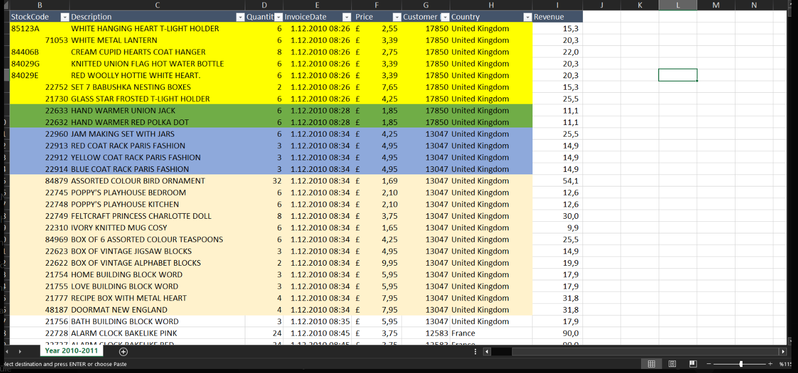
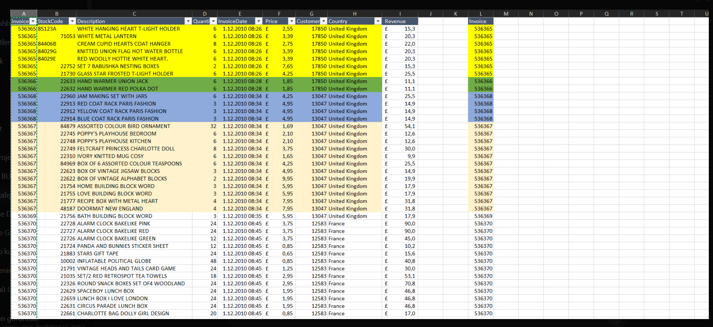
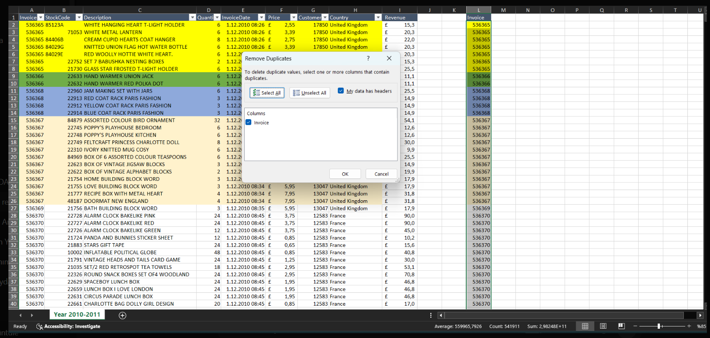
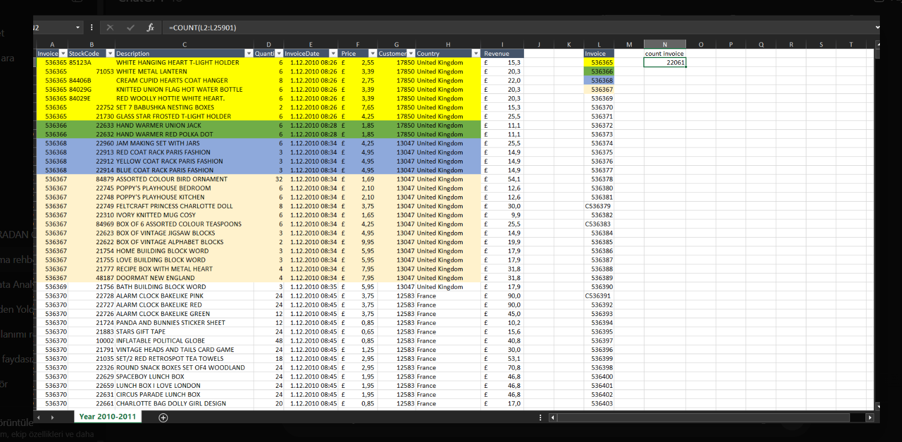
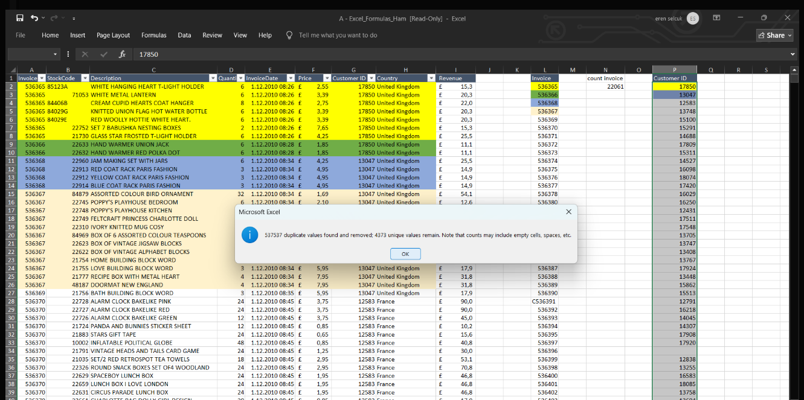
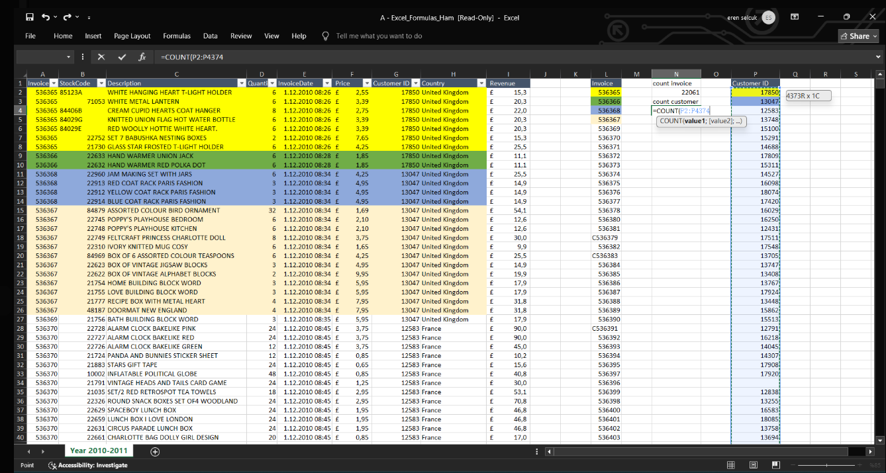
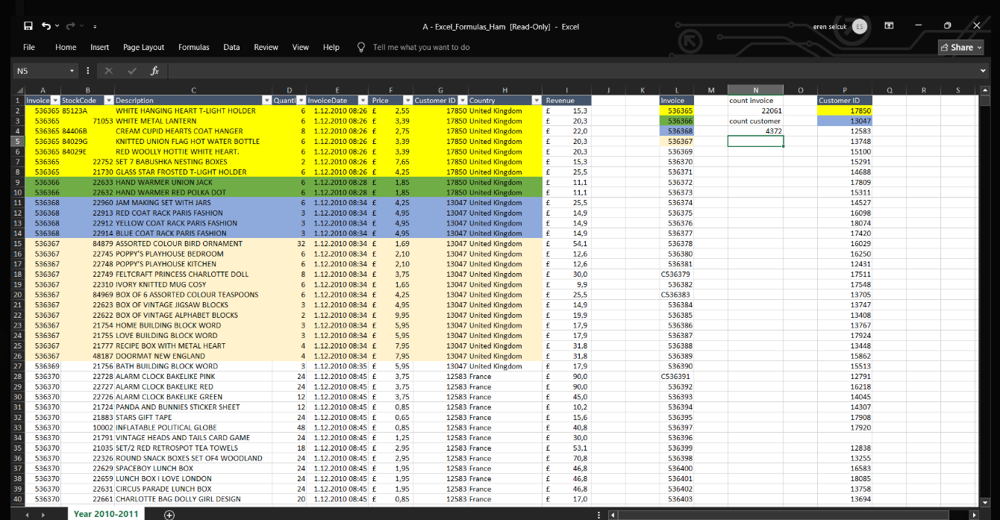
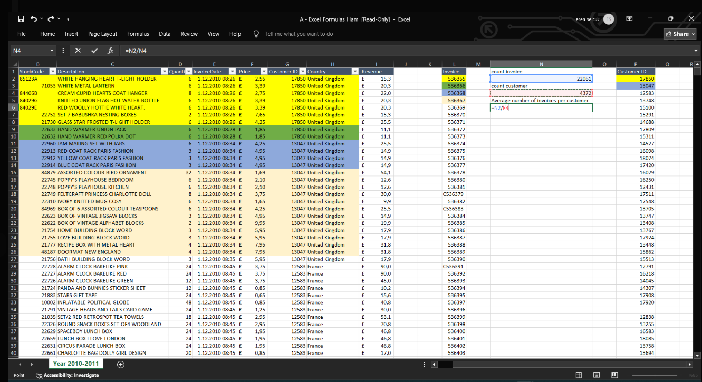
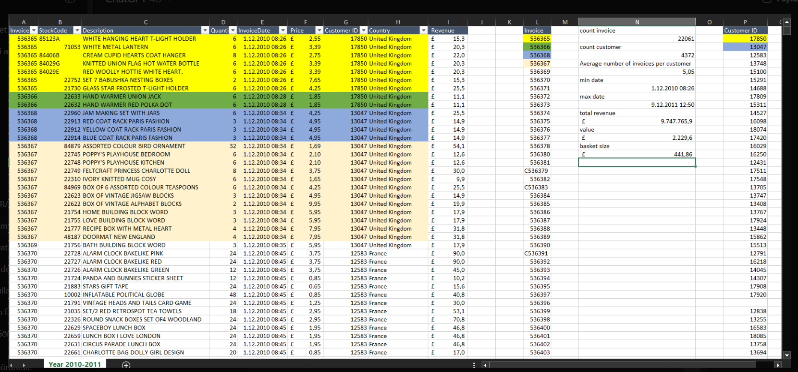

# 📊 Excel Sales Analysis (2010–2011)

A comprehensive Excel-based sales analysis project. This analysis explores customer behavior, revenue trends, and basket metrics between December 2010 and December 2011.

---

## 📁 Dataset Summary

- **Period Covered:** 1 December 2010 → 9 December 2011  
- **Total Invoices:** 22,061  
- **Unique Customers:** 4,372  
- **Countries Included:** 🇬🇧 United Kingdom, 🇫🇷 France, and more  
- **Total Revenue:** £9,747,765.90  
- **Average Basket Size:** £441.86  
- **Average Number of Invoices per Customer:** 5.05  

---

## 🧮 Key Metrics Calculated

| Metric                     | Value         |
|---------------------------|---------------|
| Total Revenue              | £9,747,765.90 |
| Total Orders (Invoices)    | 22,061        |
| Unique Customers           | 4,372         |
| Avg. Revenue per Customer  | £2,229.60     |
| Avg. Basket Size           | £441.86       |
| Avg. Invoices per Customer | 5.05          |
| First Invoice Date         | 1 Dec 2010    |
| Last Invoice Date          | 9 Dec 2011    |

---

## 🛠 Excel Operations Used

- ✅ Pivot Tables (for country & customer segmentation)  
- ✅ Custom Formulas  
  - `=AVERAGE()`, `=SUM()`, `=COUNT()`  
- ✅ Revenue & Basket Size Calculations  
- ✅ DateTime Operations  
- ✅ Conditional Formatting  
- ✅ Customer-level insights using `Customer ID`

---

## 📷 Visualizations

All key insights were supported by original Excel screenshots.

### 🖼 Sample Screens:
| Metric Screenshot                               | Description                                      |
|--------------------------------------------------|--------------------------------------------------|
|                        | Total Revenue, Customer Count                   |
|                        | Invoice                                         |
|                        | Invoice – Remove Duplicate                      |
|                        | Invoice Count                                   |
|                        | Duplicate Customer Detection                    |
|                        | Customer Count                                  |
|                        | Basket Size Calculations                        |
|                      | Average Number of Invoices per Customer         |
|                      | Min/Max Date + All Calculations Summary         |
> ✅ All screenshots are stored in the `/assets` folder.

## 📄 Raw Data (Excel File)

The full cleaned dataset is included below for reference and reproduction.

📂 **Download the Excel File**: [Click here to access excel-sales-data.xlsx via Google Drive](https://docs.google.com/spreadsheets/d/1R-ESHELXBUa1fEVTjO5X34ctvjrLflhy/edit?usp=sharing&ouid=102618739620148941630&rtpof=true&sd=true)
---

